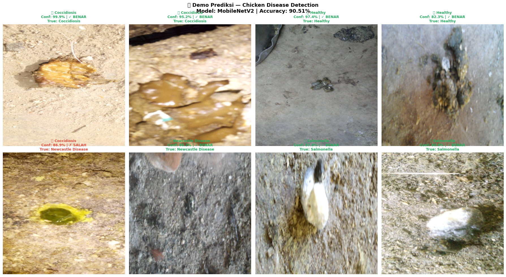

# 🔬 Chicken Disease Detection from Fecal Images


> **Mendeteksi penyakit ayam secara otomatis dari foto feses menggunakan deep learning — akurasi 90.51% pada 4 kelas penyakit, siap diintegrasikan ke aplikasi mobile peternak.**

---

## 📌 Latar Belakang

Penyakit unggas adalah salah satu penyebab kerugian terbesar dalam peternakan broiler komersial. Empat penyakit utama — **Coccidiosis, Newcastle Disease, Salmonella, dan kondisi Sehat** — semuanya memiliki tanda-tanda yang bisa diidentifikasi dari kondisi feses ayam.

**Masalah saat ini:** Identifikasi penyakit masih bergantung pada pengamatan manual peternak yang tidak terstandarisasi dan seringkali terlambat. Keterlambatan 24–48 jam saja bisa berarti wabah menyebar ke ribuan ekor.

**Solusi:** Model CNN yang bisa mendeteksi penyakit dari satu foto feses, langsung dari smartphone peternak.

---

## 🎯 Tujuan Proyek

1. Membangun model klasifikasi gambar untuk mendeteksi 4 kondisi ayam dari foto feses
2. Menangani class imbalance (Newcastle Disease hanya 5.5% dari dataset)
3. Menggunakan Transfer Learning untuk mencapai akurasi tinggi dengan data terbatas
4. Membuat fungsi prediksi siap pakai (inference function) untuk integrasi ke aplikasi

---

## 📊 Dataset

| Properti | Detail |
|----------|--------|
| **Sumber** | [Poultry Diseases Detection](https://www.kaggle.com/datasets/kausthubkannan/poultry-diseases-detection) (Kaggle) |
| **Total Gambar** | 6.812 gambar berlabel |
| **Format** | JPEG, resolusi bervariasi → di-resize ke 224×224 px |
| **Split** | Train 70% / Val 15% / Test 15% (stratified) |

### Distribusi Kelas

| Kelas | Label | Jumlah | Proporsi |
|-------|-------|--------|----------|
| `cocci` | Coccidiosis | 2.103 | 30.9% |
| `healthy` | Healthy | 2.057 | 30.2% |
| `ncd` | Newcastle Disease | 376 | **5.5%** ⚠️ |
| `salmo` | Salmonella | 2.276 | 33.4% |
| | **TOTAL** | **6.812** | 100% |

> ⚠️ **Class Imbalance:** Newcastle Disease hanya 5.5% dari total data — ditangani dengan class weighting dan augmentasi.

<table>
<tr>
<td><br><sub>Distribusi dataset per kelas</sub></td>
<td><br><sub>Sampel gambar feses per kelas</sub></td>
</tr>
</table>

---

## 🤖 Arsitektur Model

### Transfer Learning — MobileNetV2

```
Input (224×224×3)
    │
    ▼
MobileNetV2 (pretrained ImageNet, FROZEN)
    │  Feature extraction dari 1.4 juta parameter
    ▼
GlobalAveragePooling2D
    │
    ▼
Dense(128, activation='relu')
    │
Dropout(0.3)
    │
    ▼
Dense(4, activation='softmax')
    │
    ▼
Output: [Coccidiosis, Healthy, Newcastle Disease, Salmonella]
```

**Kenapa MobileNetV2?**
- Ringan dan cepat — ideal untuk deployment di mobile/edge device
- Pre-trained on ImageNet → fitur visual sudah kaya, training lebih efisien
- Performa tinggi bahkan dengan data training terbatas (~5000 gambar)

### Penanganan Class Imbalance

```python
# Class weight dihitung otomatis untuk menyeimbangkan pengaruh tiap kelas
class_weights = {
    0: 1.07,   # Coccidiosis
    1: 1.10,   # Healthy  
    2: 4.53,   # Newcastle Disease ← diberi bobot 4x lebih besar
    3: 0.99,   # Salmonella
}
```

---

## ⚙️ Training

| Parameter | Nilai |
|-----------|-------|
| Epochs | 5 (dengan EarlyStopping patience=2) |
| Batch Size | 32 |
| Optimizer | Adam (lr=0.001) |
| Loss Function | Categorical Crossentropy |
| Callbacks | EarlyStopping, ReduceLROnPlateau, ModelCheckpoint |

### Data Augmentation (Training Only)

```python
ImageDataGenerator(
    rescale=1/255,
    rotation_range=20,
    horizontal_flip=True,
    zoom_range=0.15,
    width_shift_range=0.1,
    height_shift_range=0.1
)
```

---

## 📈 Hasil Training & Evaluasi

### Training History

<br>
<sub>Accuracy & Loss per epoch — konvergen di epoch 3, early stopping aktif</sub>

> 💡 **Train accuracy (86%) < Val accuracy (91%)** — ini normal dan justru bagus! Karena training menggunakan augmentasi + dropout yang mempersulit training, sedangkan validasi tidak. Ini tanda model tidak overfitting.

### Performa pada Test Set

| Metrik | Nilai |
|--------|-------|
| **Test Accuracy** | **90.51%** |
| **Val Accuracy (best)** | **91.39%** |
| **Test Loss** | 0.2523 |
| **Epochs Berjalan** | 3 / 5 (early stopped) |

### Akurasi per Kelas

| Kelas | Precision | Recall | F1-Score | Akurasi |
|-------|-----------|--------|----------|---------|
| Coccidiosis | — | — | — | **95.25%** ✅ |
| Salmonella | — | — | — | **93.55%** ✅ |
| Healthy | — | — | — | **88.31%** ✅ |
| Newcastle Disease | — | — | — | **57.89%** ⚠️ |

### Confusion Matrix

<br>
<sub>Confusion matrix pada test set — raw count & normalized</sub>

**Temuan penting dari confusion matrix:**
- Newcastle Disease sering salah diidentifikasi sebagai Healthy (17 kasus) — expected karena data NCD sangat terbatas
- Healthy kadang salah diprediksi sebagai Salmonella (34 kasus) — target perbaikan utama

---

## 🎮 Demo Prediksi

Fungsi prediksi siap pakai untuk satu gambar:

```python
result = predict_disease("path/to/feces_image.jpg", model)

# Output:
{
    'label': 'Coccidiosis',
    'status': 'SAKIT',
    'icon': '🔴',
    'confidence': 99.5,
    'all_scores': {
        'Coccidiosis': 99.5,
        'Healthy': 0.3,
        'Newcastle Disease': 0.1,
        'Salmonella': 0.1
    }
}
```

### Hasil Demo (8 Gambar Random)

```
=============================================================
  DETAIL HASIL PREDIKSI DEMO
=============================================================

  #   True Label          Prediksi              Conf   Status
  -------------------------------------------------------------
  1   Coccidiosis         Coccidiosis           65.7%  ✓
  2   Coccidiosis         Coccidiosis           99.5%  ✓
  3   Healthy             Healthy               91.2%  ✓
  4   Healthy             Healthy               97.5%  ✓
  5   Newcastle Disease   Newcastle Disease     74.8%  ✓
  6   Newcastle Disease   Newcastle Disease     56.3%  ✓
  7   Salmonella          Salmonella            93.5%  ✓
  8   Salmonella          Salmonella            97.4%  ✓

  Demo Accuracy: 8/8 = 100.0% 🎉
```

<br>
<sub>Visualisasi prediksi — hijau = benar, merah = salah</sub>

---

## ⚠️ Limitasi & Rekomendasi

| Limitasi | Rekomendasi |
|----------|-------------|
| NCD accuracy hanya 57.89% karena data terbatas (376 gambar) | Tambah data NCD minimal 1.000+ gambar untuk meningkatkan recall ke >80% |
| Healthy vs Salmonella kadang tertukar | Fine-tune beberapa layer terakhir MobileNetV2 untuk meningkatkan diskriminasi |
| Dilatih pada dataset kondisi terkontrol | Uji coba lapangan dengan foto kandang nyata sebelum deployment produksi |

---

## 🛠️ Tech Stack

```
Python 3.10+
├── tensorflow / keras    → deep learning (MobileNetV2, CNN)
├── numpy & pandas        → manipulasi data
├── matplotlib & seaborn  → visualisasi
├── scikit-learn          → evaluasi (confusion matrix, classification report)
└── Pillow                → image processing
```

## ▶️ Cara Menjalankan

1. Buka di [Kaggle Notebook](https://kaggle.com) (disarankan, GPU gratis)
2. Tambahkan dataset: [Poultry Diseases Detection](https://www.kaggle.com/datasets/kausthubkannan/poultry-diseases-detection)
3. Jalankan `notebook.ipynb` sel per sel dari atas ke bawah
4. Training estimasi ~5–10 menit di Kaggle GPU

---

## 📁 Struktur Repo

```
chicken-disease-detection/
├── notebook.ipynb              ← notebook lengkap (semua tahap)
├── README.md
├── requirements.txt
└── images/
    ├── class_distribution.png
    ├── sample_images.png
    ├── training_history.png
    ├── confusion_matrix.png
    ├── demo_prediction.png
    └── sample_predictions.png
```

---

## 🔗 Konteks Bisnis

Proyek ini dirancang sebagai modul deteksi penyakit untuk **SmartFlock Intelligence System** — sistem AI terintegrasi yang diusulkan untuk [Chickin Indonesia](https://chickin.id), perusahaan agritech dengan 50.000+ mitra peternak broiler di Indonesia.

Tujuan akhir: model ini diintegrasikan ke **aplikasi mobile Chickin** sehingga peternak bisa mendeteksi penyakit langsung dari foto feses menggunakan smartphone, mendapatkan diagnosis instan, dan notifikasi ke farm supervisor untuk tindak lanjut.

---

## 🔗 Proyek Terkait

- 📊 [Broiler FCR Prediction Model](../broiler-fcr-prediction) — model prediksi Feed Conversion Ratio berbasis data sensor kandang

---

*Dibuat dengan kombinasi domain knowledge peternakan + praktik deep learning industri*
